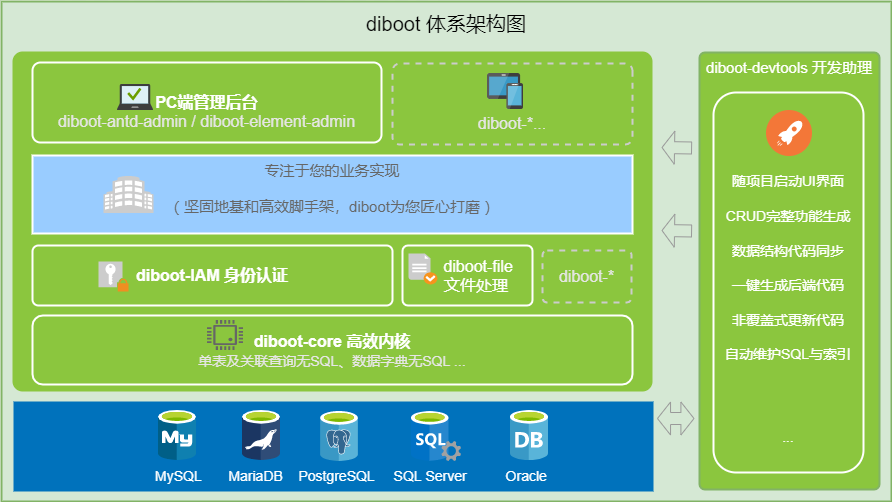

> 助力抗击疫情，diboot 团队紧急上线公益“轻统计工具”，无需注册，Excel一键生成在线填报表单、快速收集统计数据。[<点我使用>](http://s.dibo.ltd/#/g "注解自动绑定多表关联")

# diboot

    
    

>  [设计目标](https://segmentfault.com/a/1190000020906742)：面向开发人员的低代码开发平台，将重复性的工作自动化，提高质量、效率、可维护性。

diboot v2版本，目前实现: diboot-core全新内核 + diboot-devtools开发助理 + IAM身份认证、file文件处理等基础组件 + diboot-*-admin基础后台。

## 一、 diboot-core: 精简优化内核
全新精简内核，《高性能MySQL》重构查询方式的最佳实践，主要实现：
#### 1. 单表CRUD无SQL
   > 基于Mybatis-Plus实现（Mybatis-Plus具备通用Mapper方案和灵活的查询构造器）
#### 2. 关联查询绑定无SQL（注解自动绑定）
   > 扩展实现了多表关联查询的无SQL方案，只需要一个简单注解@Bind*，就可以实现关联对象（含字段、字段集合、实体、实体集合等）的数据绑定，且实现方案是将关联查询拆解为单表查询，保障最佳性能。
#### 3. 数据字典无SQL（注解自动绑定）
   > 通过@BindDict注解实现数据字典(枚举)的存储值value与显示值name的转换。
#### 4. 跨表查询无SQL（QueryWrapper自动构建与查询）
   > @BindQuery注解绑定字段参数对应的查询条件及关联表，自动将请求参数绑定转换为QueryWrapper，并动态执行单表或Join联表查询。
#### 5. 其他常用Service接口、工具类的最佳实践封装
   > 字符串处理、常用校验、BeanUtils、DateUtils等
   
基于diboot-core 2.x版本的CRUD和简单关联的常规功能实现，代码量比传统Mybatis项目减少80%+），且实现更高效更易维护。   
更多介绍请查看: [diboot-core README](https://github.com/dibo-software/diboot-v2/tree/master/diboot-core "注解自动绑定多表关联"). 

## 二、 diboot-devtools 自动化开发助理

* 支持多数据库（MySQL、MariaDB、ORACLE、SQLServer、PostgreSQL）
* 使用很简单（UI界面操作，引入依赖，配置参数后，即可随SpringBoot本地项目启动运行）
* 功能很强大（数据结构变更与代码联动同步，一键生成&非覆盖式更新后端代码，一键生成前端功能代码，自动记录变更SQL、维护索引）
* 配置很灵活（可按需配置生成代码是否启用`Lombok`、`Swagger`等）
* SQL与代码很标准（devtools标准化了数据结构定义与代码实现，降低维护成本）
* 单表与联表场景完整CRUD功能完全自动生成，无需手写代码
> [我要试试](https://www.diboot.com/guide/diboot-devtools/%E4%BB%8B%E7%BB%8D.html)

## 三、iam-base 身份认证基础组件 及 配套VUE前端框架（diboot-antd-admin、diboot-element-admin）

* RBAC角色权限模型 + JWT的认证授权 实现，支持刷新token
* 简化的BindPermission注解，支持兼容shiro的简化权限绑定与自动鉴权
* 自动提取需要验证的后端接口, 借助前端功能方便绑定前后端菜单按钮权限
* 支持灵活的扩展能力（扩展多种登录方式、灵活替换用户实体类、自定义缓存等）
* Starter启动自动安装依赖的数据表
* 启用devtools，自动生成初始controller代码到本地

更多介绍请查看: [iam-base-starter README](https://github.com/dibo-software/diboot-v2/tree/master/iam-base-starter "身份认证管理组件"). 

## 四、diboot-file 文件相关处理组件

* EasyExcel轻量封装，支持Java注解校验与@BindDict注解实现字典name-value转换，提供完善的校验错误提示
* 封装常用的文件本地存储、上传下载、图片压缩水印等常用处理
* Starter启动自动安装依赖的数据表
* 启用devtools，自动生成初始样例controller代码到本地

更多介绍请查看: [diboot-file-starter README](https://github.com/dibo-software/diboot-v2/tree/master/diboot-file-starter "文件组件"). 

> 其他组件逐步开发中 ...

## 五、技术交流群

如果您有技术问题，欢迎加群交流：

> QQ群: [731690096]() 

> 微信群（备注diboot）加: [wx20201024]()  
