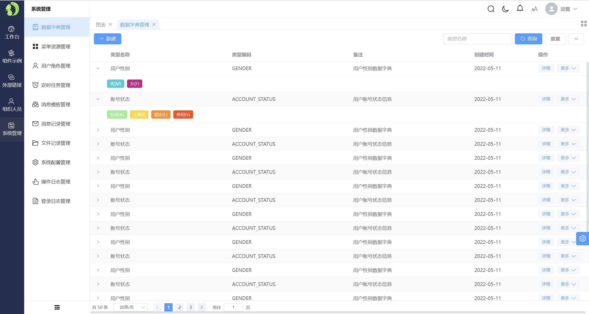

<div align="center">


<h1>Diboot Admin UI</h1>

</div>

## 介绍
diboot-admin-ui 基于Vue3、TS、Element Plus的中后台管理框架，也是Diboot的配套前端框架。

## 演示和文档

| 类型 | 链接 |
| -------- | -------- |
| 文档地址 | http://v3.diboot.com/pages/adminui_introduce/ |
| 演示地址  | http://demo-v3.diboot.com/#/login |
| 项目地址  | https://gitee.com/dibo_software/diboot |

## 相关技术栈

> - 前端基础
> - Vue全家桶：[Vue 3.x](https://cn.vuejs.org/), [vue-router 4.x](https://router.vuejs.org/zh/), [axios](https://github.com/axios/axios)
> - 存储库：[Pinia](https://pinia.web3doc.top/)
> - 组件库：[Element Plus](https://element-plus.gitee.io/zh-CN/)
> - TypeScript + ES6语法。

## 项目特性

* 更美观的UI，以及多种菜单导航、主题色、夜间模式、字体等风格配置；
* 登录、权限、接口对接上，与diboot相关后端组件无缝集成且开箱可用；
* 提取CRUD页面相关通用属性与方法到hooks文件中，简化代码；
* 菜单到按钮级别的细粒度权限控制、自动token刷新；
* 基于后端自动提取的智能化权限配置方案；
* 预置多种常用请求方式，轻松完成异步文件下载等；
* 预置上传、富文本、导入、预览打印、水印组件
* 预置:
  * 组织人员岗位管理功能；
  * 数据字典管理功能；
  * 菜单资源管理功能；
  * 角色与权限管理功能；
  * 定时任务管理功能；
  * 消息模板管理功能、消息记录管理功能；
  * 文件记录管理功能；
  * 登录日志管理功能、操作日志管理功能；
  * 系统配置管理功能；
  * 国际化配置；

## 部分截图




## 安装教程
``` sh
# 克隆项目
git clone https://gitee.com/dibo_software/diboot-admin-ui.git

# 进入项目目录
cd diboot-admin-ui

# 安装依赖
pnpm install

# 启动项目(开发模式)
pnpm run dev
```
启动完成后浏览器访问 http://localhost:5173

## 支持
如果您觉得本项目不错或对您有所帮助，请帮我们点亮星星，这是对我们最大的支持和鼓励！