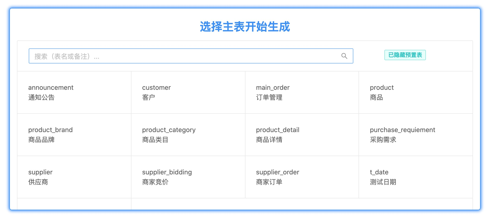
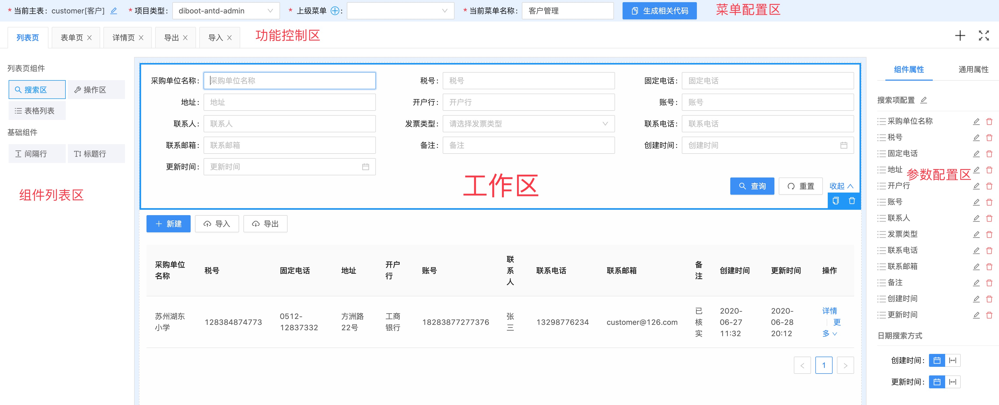
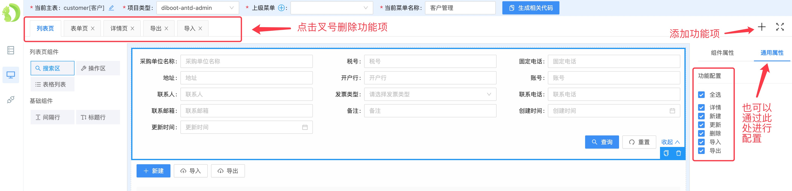
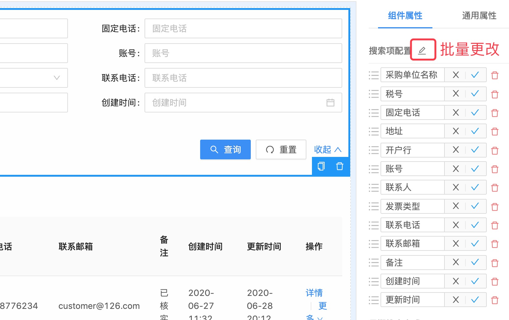

# 前端功能生成 （企业版）

* 在2.1.x版本之后，devtools已经支持PC端管理后台前端常规功能的生成。他可以帮您完成以下事项：
    * 单表和具有关联关系的CRUD前端功能生成。
    * 完成常见的多种表单类型的自动化处理（主要包括单行文本、多行文本、富文本、关联数据选择框、开关选项、日期选择器、日期时间选择器、单文件上传、多文件上传、单图片上传、多图片上传、数字类型等），满足更多场景需要。
    * Excel导入预览与导入上传功能的自动化生成，导入功能从此变得简单。
    * Excel导出功能的自动化生成，一键实现导出。
    * 自动添加所需菜单项，省去配置菜单的烦恼。
    * 自动绑定生成的菜单、按钮与后端接口的权限，省去权限的烦恼。
    * 上述特性可以用于我们的两套前端项目中，分别为基于antdv的diboot-antd-admin和基于element的diboot-element-admin，给您更多选择。
* 前端相关功能都可以通过可拖拽的配置界面进行快速配置，这个可拖拽的配置界面，以下简称**设计器**。
* 点击左侧导航栏中第二个图标按钮（前端功能生成），即可开始前端生成之旅了。

::: tip
Diboot提供的前端代码生成功能，只能适用于我们提供的与之配套的同版本diboot前端项目中。分别为：[diboot-element-admin](https://github.com/dibo-software/diboot-element-admin/releases) 和  [diboot-antd-admin](https://github.com/dibo-software/diboot-antd-admin/releases)
:::
::: tip
前端代码的生成会一定程度上依赖于后端代码，所以建议先将当前表的后端代码生成完毕，当然，如果当前表关联的有其他表，那么其他表的后端代码就更应该在当前表后端代码之前生成好了。所以建议生成顺序是：关联的其他表后端代码生成 --> 当前表后端代码生成 --> 关联表前端代码生成 --> 当前表前端代码生成
:::

## 选择一个主表

* 可以在显示出的表列表中选择一个主表来前端相关页面的配置与代码生成。
* 显示表中不显示系统预置表，所以不能对系统预置表做生成前端的相关操作。
* 可通过搜索框对**表名**或**表备注**进行一个模糊匹配的搜索。

## 设计器

在选择好主表之后，便进入到了这张主表专属的设计器页面了，在开始之后的工作之前，请容许我先介绍下我们的PC设计器。

设计器主要分为五部分，分别为：菜单配置区、功能控制区、组件列表区、工作区、参数配置区，以下为设计器区域图示：

* 菜单配置区：主要配置父级菜单与当前菜单名称，进行前端代码生成功能控制等。
* 功能控制区：控制当前前端代码所覆盖的功能项及功能范围。
* 组件列表区：列出当前功能项可以配置的所有组件列表。
* 工作区：进行组件效果的实时预览与控制，可以也可以在此复制、删除相关组件。
* 参数配置区：分为**组件属性**与**通用属性**：
    * 组件属性：为当前选中组件进行相关参数配置。
    * 通用属性：为整个设计器或者整个功能项进行相关配置。

## 配置所需功能

对于该表涉及到的相关功能项，可通过以下方式进行配置：

* 通过上方标签栏，进行功能项的增加与删除；
* 通过右侧**通用属性**栏的checkbox进行功能项的批量配置，图示如下：

## 工作区

* 组件可从左侧组件列表区域拖拽入中间的工作区内。
* 拖拽之后，在右侧**参数配置区**配置相关参数后，工作区也将实时展示预览效果。

::: tip
在基于diboot-antd-admin项目中，预览效果与实际效果几乎无异。在基于diboot-element-admin项目中，预览效果与实际效果会有样式上的差异，但功能项总体无异。
:::

## 配置字段列表

对于列表搜索、列表表格、表单组件、详情组件、导入组件、导出组件等可配置字段列表，配置区可增加或删除，也可更改字段标签名。

## 更改字段标签名

* 可以单个点击更改图片进行更改。
* 也可以店家列表上方的更改图片进行批量更改，这里可以使用回车键与esc键来进行确认与取消，如下：

## 详情页实体列表组件

详情页实体列表配置使用场景主要用于在接口返回的详情数据中绑定了其他对象列表的场景下，如果具有这种接口，可以在这里拖拽入实体列表，将会自动进行配置，如果提示错误，则需要在工作区删掉该组件。

 