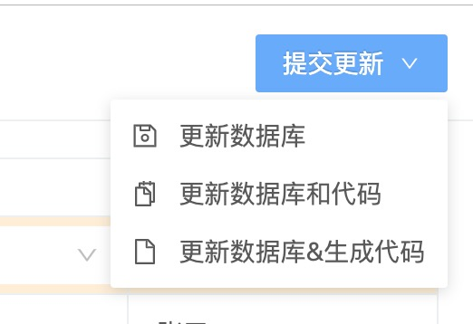
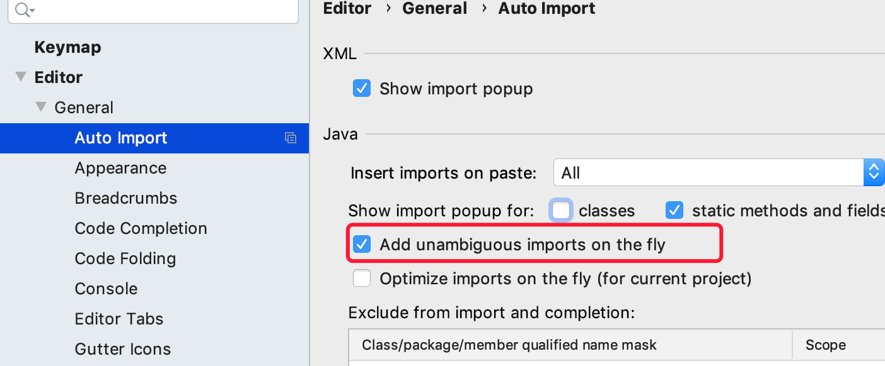

# 代码生成与更新

:::warning
在具有表关联的场景下，请先生成关联表的相关后端代码，然后再生成当前表的相关后端代码。
:::

> 数据设计完成后，需要提交相关更改。点开右上角「提交更新」下拉菜单，这里有三个按钮：仅更新数据库、更新数据库和代码、重新生成代码并更新数据库。



:::tip
如果使用IDEA，请开启自动导包配置，如下图：


:::


## 更新数据库
* 该操作，只是对**数据库表结构**及**样例数据**进行更新，不会涉及代码的生成与更新。
* 数据结构相关更改，将以SQL代码的形式保存修改内容到`update.sql`文件，保存更改的update.sql文件存放位置可以根据以下配置来设置更新的sql文件存放位置。
```properties
# 此处使用相对于项目的相对路径
diboot.devtools.output-path-sql=devtools-example/src/main/resources/
```

## 更新数据库和代码
* 该操作会更新**数据库表结构**及**样例数据**，以及将数据结构的更改SQL记录到对应的sql文件中，这点与**仅更新数据库**功能相同。
* 会在已有代码的基础上，对Entity、DTO、VO、Service及其实现类、Mapper类、Controller类中涉及到的代码进行更新。
* 更新过程中，仅会对更改的相关字段所涉及到的相关字段以及方法进行更新。
* 这些被更新的字段以及方法不会影响到其他的字段以及方法，因此对于相关联的字段以及方法之外的代码并没有影响。
* 对于被更新的方法，将会覆盖原方法，目前将会覆盖的方法主要为entity以及vo中与更改相关联的字段的**getter/setter**方法

## 更新数据库&生成代码
* 该操作会更新**数据库表结构**及**样例数据**，以及将数据结构的更改SQL记录到对应的sql文件中，这点与**仅更新数据库**功能相同。
* 会**重新生成*Entity、DTO、VO、Service及其实现类、Mapper及其映射文件、Controller文件等。
::: warning
注意：该功能是完全的重新生成代码，同名的相关文件都将被覆盖。
:::