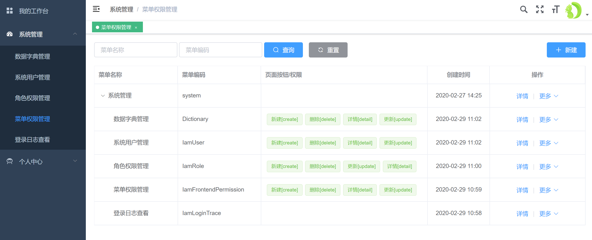
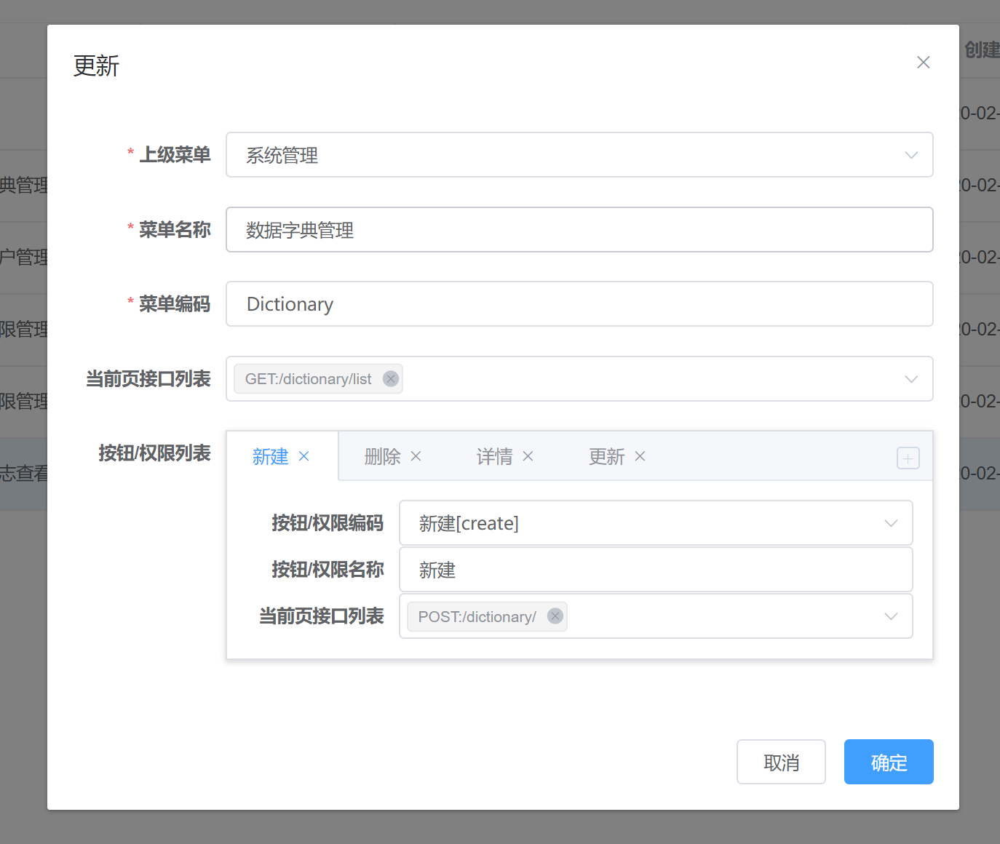
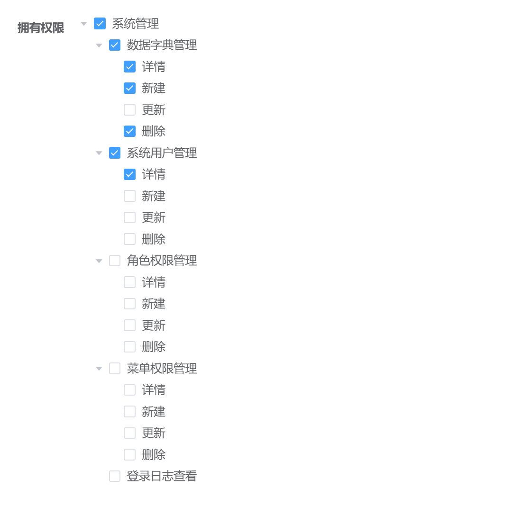

# 权限控制

## 简介

* 该项目使用的权限控制模型为RBAC角色权限模型；
* 支持按钮级别的权限控制；
* 权限分发路径：菜单/按钮/权限-->树状层级结构的权限集-->角色-->角色列表-->用户；
* 在添加新的需要进行权限控制的页面后，需要进行该页面权限的配置，然后在相关角色中对该权限进行授权；

## 菜单权限配置

菜单如果要进行权限控制，一定需要添加在 **src/router/index.js** 文件中的 asyncRoutes 中，且需要配置 meta 属性中的 permission 列表，如下：
```javascript
{
    path: 'iamLoginTrace/list',
    name: 'IamLoginTraceList',
    component: () => import('@/views/system/iamLoginTrace/list'),
    meta: { title: '登录日志查看', permission: ['IamLoginTrace'] }
}
```

## 按钮权限配置

按钮的权限控制，是通过指令控制该按钮是否显示来实现的，一共具有三个指令来控制是否按钮是否显示。
 
* v-permission
    * 将该按钮或元素在具有权限列表中的某条权限时显示出来；
    * 可以添加多条按钮权限编码，有一条权限存在，就将显示该按钮，比如  v-permission="['update', 'delete']"，标识当具有update或者delete中的一种权限时，该按钮将会显示。
* v-permission-again
    * 与上述v-permission指令功能一样，用于为同一按钮同时设置两条与逻辑的指令，即 v-permission 与 v-permission-again 这两条指令的权限都存在时，才显示该按钮或元素。
    
```html
<span
    v-permission="['detail']"
    v-permission-again="['update', 'delete']"
>
    <el-divider
      direction="vertical"
    />
</span>
```

* v-permission-missing
    * 对该按钮或元素在具有权限的时候隐藏；
    * 可以添加多条权限编码，有一条权限存在，就将隐藏该按钮，如下代码就将会在没有详情、更新、删除权限时，将操作栏显示为 -

```html
<span v-permission-missing="['detail', 'update', 'delete']">
  -
</span>
```

上述按钮权限配置，可以在已有的相关功能中找到：
```html
<template slot-scope="{row}">
  <el-button
    v-permission="['detail']"
    type="text"
    @click="$refs.detail.open(row.id)"
  >
    详情
  </el-button>
  <span
    v-permission="['detail']"
    v-permission-again="['update', 'delete']"
  >
    <el-divider
      direction="vertical"
    />
  </span>
  <el-dropdown
    v-permission="['update', 'delete']"
    @command="command => menuCommand(command, row)"
  >
    <el-button type="text">
      更多<i class="el-icon-arrow-down el-icon--right"></i>
    </el-button>
    <el-dropdown-menu slot="dropdown">
      <el-dropdown-item
        v-permission="['update']"
        command="update"
        icon="el-icon-edit"
      >
        更新
      </el-dropdown-item>
      <el-dropdown-item
        v-permission="['delete']"
        command="delete"
        icon="el-icon-delete"
      >
        删除
      </el-dropdown-item>
    </el-dropdown-menu>
  </el-dropdown>
  <span v-permission-missing="['detail', 'update', 'delete']">
    -
  </span>
</template>
```

## 菜单权限管理

* 使用具有超级管理员权限的账号登入项目；
* 打开 系统管理-->菜单权限管理 页面，可看到已有权限列表：

* 点击新建，开始配置新增页面的权限，下图是已有权限配置好之后的表单示例：

* 菜单编码对应上述**菜单权限配置**中的permission列表中的值，默认我们只在meta的permission中配置一个值与此处对应即可；
* 下方**按钮/权限里列表**配置中，按钮/权限编码，需要与上述添加在按钮的指令中的参数一致，这里默认配置了一些常用操作类型到数据字典中，如果有新的操作按钮，可以到数据字典的**前端按钮/权限编码**中进行增加；
* 在权限配置中，对于常用的权限，都可以通过点击和选取来完成对菜单和按钮权限的配置；
* 在配置好前端菜单与接口列表，和前端按钮与接口列表后，也完成了前端菜单与按钮和后端接口的关系绑定，之后在对角色设置相关权限后，控制前端界面是否显示的同时，也控制了该角色下的用户对后端对应接口的访问权限；
* 在权限配置完成后，如果需要更改权限显示顺序，可以点击该列表页面右上角“排序”按钮进行权限拖拽排序操作。

## 角色授权管理

* 打开 系统管理-->角色权限管理 页面，可看到当前已有角色列表；
* 新建角色 或 选择需要更改授权的角色进行编辑操作；
* 对需要授权的权限进行选中，不需要的权限取消即可，操作直观简便。


