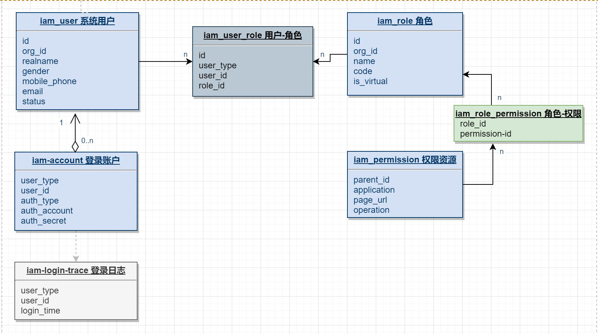

# IAM-base: 身份认证组件 (基础版)

## 组件特性
* 开箱即用的RBAC角色权限模型
* 基于JWT的认证授权，支持申请token、刷新token
* 简化的BindPermission注解，支持菜单+操作两级权限控制
* 支持BindPermission注解自动收集并更新至数据表
* 预置用户名密码登录(密码带盐加密), 并支持多种登录方式扩展
* 预置默认用户实体，并支持灵活替换用户类型
* 默认启用内存缓存，并支持自定义缓存实现类

## 角色权限模型说明

基于“用户-角色-权限”的基础模型扩展“账号”实体，以支持多种登录方式。

组件包含了与此模型相关的后端代码，且依赖的数据结构在组件starter初次启动时将自动初始化。